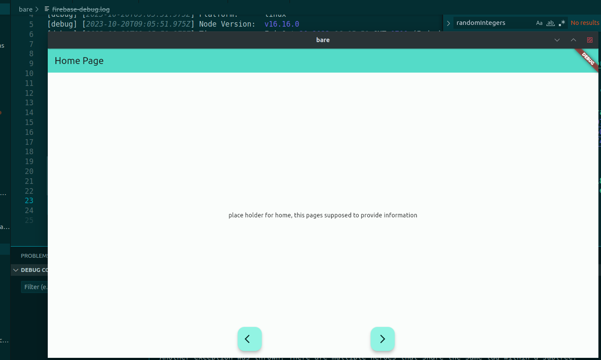
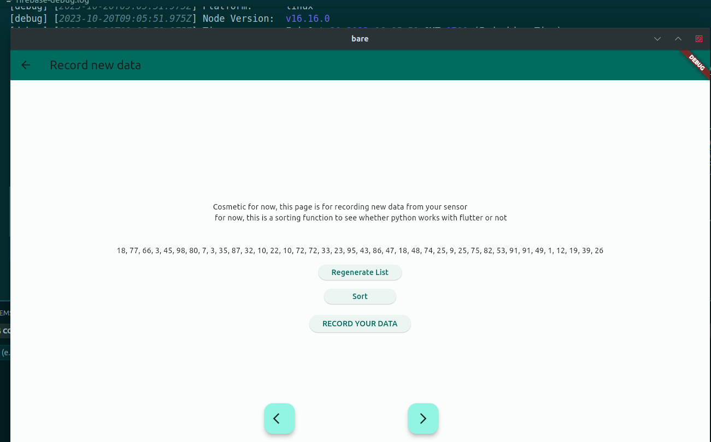
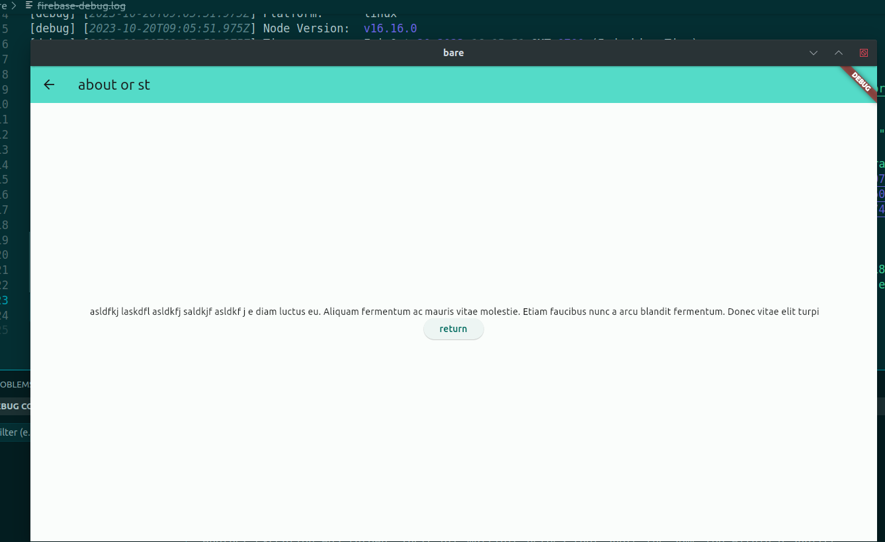
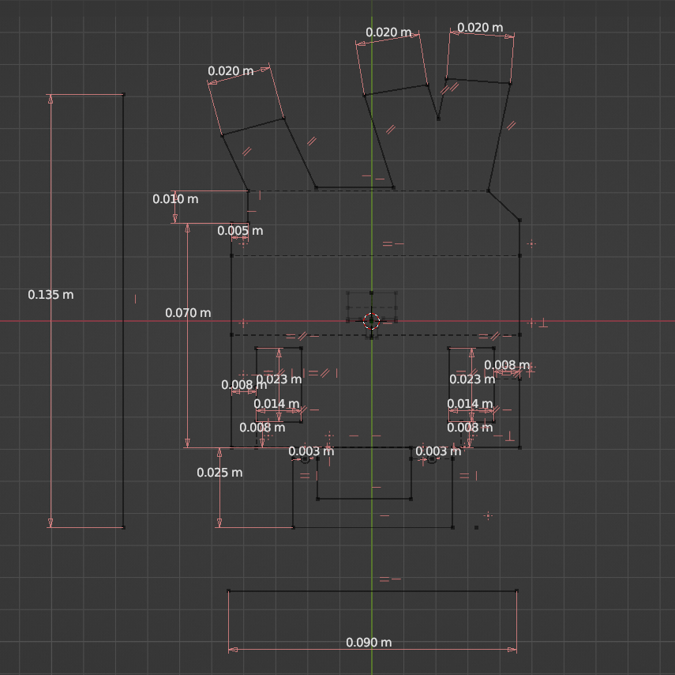
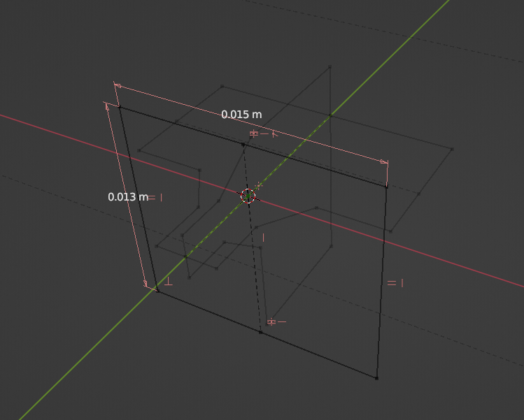
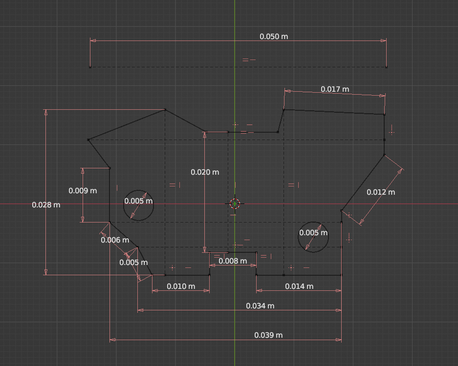
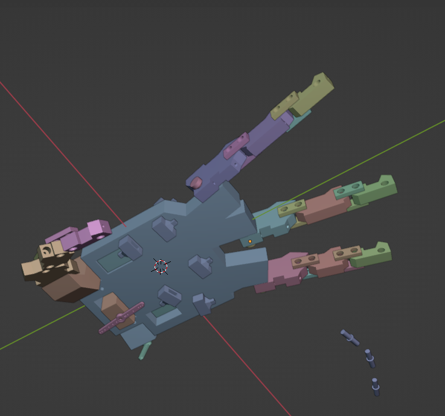

# RUN the GUI app
go to 'bare', run 'flutter run'( after setting up the prerequisite of course)

# RUN the NN
to to NN_dev, there are multiple files, in which `emg.classifier.ipynb` are multiple ways to approaches those that wield best result however placed in `classifier_to_b_used.ipynb` 
# CAD

