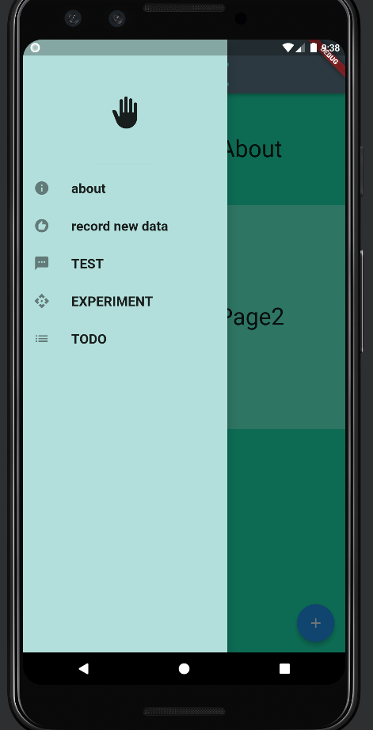
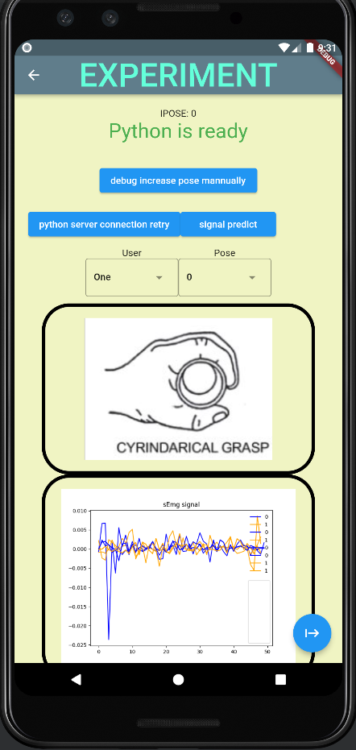
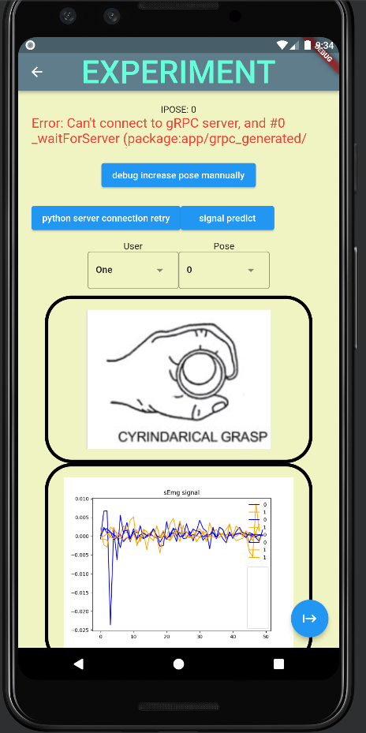
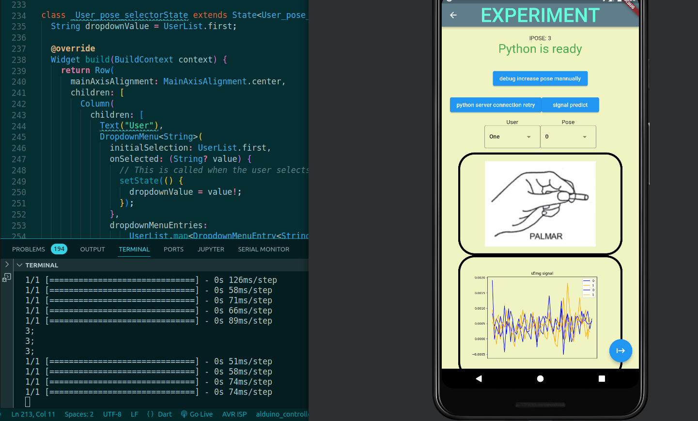
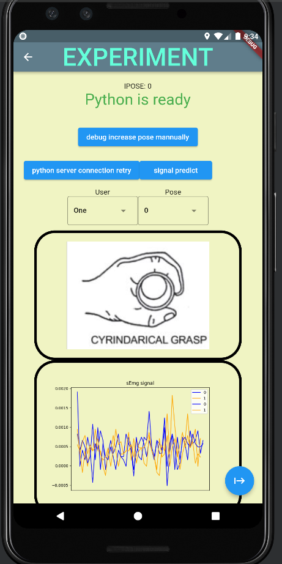
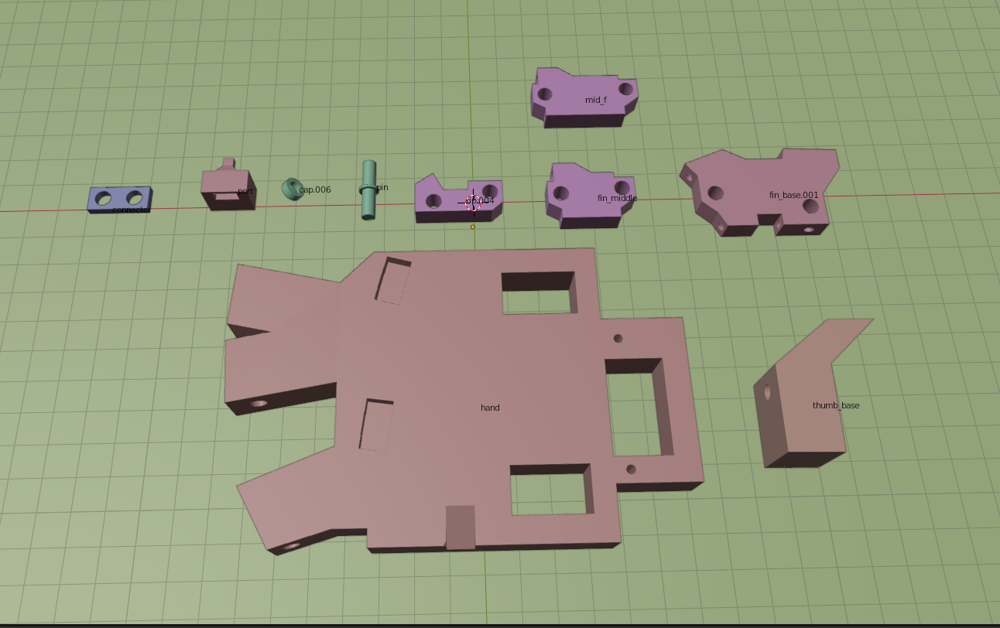

# RUN the GUI app
go to 'app', run 'flutter run'( after setting up the prerequisite of course)





# RUN the NN
to to NN_dev, there are multiple files, in which `emg.classifier.ipynb` are multiple ways to approaches those that wield best result however placed in `classifier_to_b_used.ipynb` 

# CAD




```
#  python server/server.py 
# python -m grpc_tools.protoc -I../../protos --python_out=../helloworld2 --pyi_out=../helloworld2 --grpc_python_out=../helloworld2 ../../protos/helloworld.proto
# python -m grpc_tools.protoc -I../../protos --python_out=../helloworld2 --pyi_out=../helloworld2 --grpc_python_out=../helloworld2 ../../protos/helloworld.proto
# python -m grpc_tools.protoc -I./protos --python_out=./server/grpc_generated --grpc_python_out=./server/grpc_generated ./protos/services.proto
```
./starter-kit/prepare-sources.sh --proto ./protos/services.proto --flutterDir ./app --pythonDir ./server